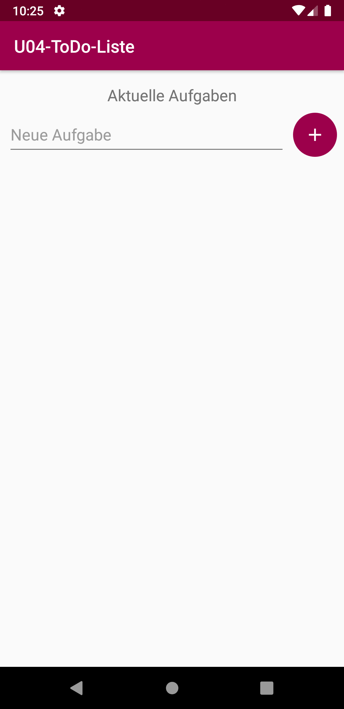
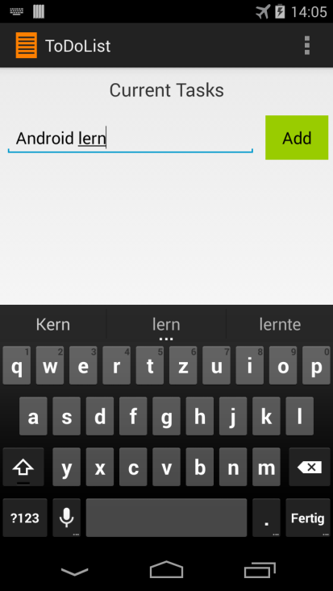
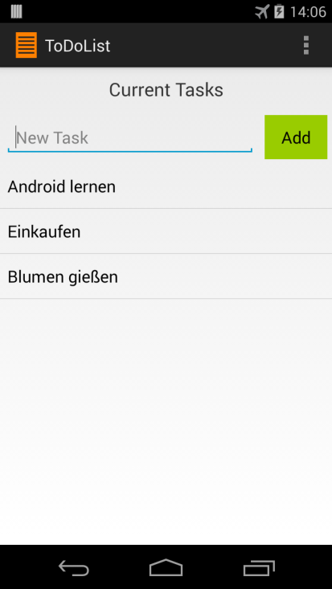

# U04 | ToDo-Liste

## Aufgabe

Erstellen Sie eine **ToDo-Liste**, die es dem Benutzer erlaubt Aufgaben über ein Eingabefeld (`EditText`) zu erstellen. Die eingegebenen Aufgaben werden in einem `ListView` angezeigt und können gelöscht werden, in dem der Benutzer länger auf den entsprechenden Eintrag in der Liste klickt (`OnItemLongClick()`). Speichern Sie die Aufgaben als String in einer entsprechenden `ArrayList` und  nutzen Sie zur Anbindung an das *User Interface* einen `ArrayAdapter`. Sie sollten bereits damit vertraut sein wie man `Views` aus dem Layout in einer Activity intialisiert. Speziell geübt werden sollen dadurch der Umgang mit `ListView` und `ArrayAdapter`.

\pagebreak

## Hinweise

* Benutzen sie für diese Übung das `Constraint Layout`. In einem Constraint Layout werden Views mittels Constraints “magnetisch” an andere gebunden um sie so relativ im Layout zu platzieren.

* Für die Implementierung eines "Hinzufügen"-`ImageButton` können sie das vorgefertigte Icon (unter `res/drawable/ic_add.xml`) als `src` verwenden und das Shape (unter `res/drawable/shape_round_primary_color.xml`) als `background`.

* Lagern Sie Texte die dem Nutzer später angezeigt werden, in die `strings.xml` (unter `res/values/strings.xm`) aus. 

* Nach dem Hinzufügen eines neuen Eintrages soll das Eingabefeld wieder leer sein.

* Beim `OnItemLongClickListener()` wird die Position des *angeklickten* Elements wird über den Parameter `position` übergeben

* Damit der Adapter Änderung aus der Liste and das `ListView` weitergibt, müssen Sie nach allen Manipulationen Ihrer Liste die Methode `notifyDatSetChanged()` des Adapters aufrufen.

## Vorgehen

Versuchen Sie „ordentlichen“ Code zu erstellen. Lagern Sie Teilaufgaben in Methoden aus. Zur Zuweisung eines *Listener* zu einem `View` reicht eine lokale Referenz innerhalb der entsprechenden Methode. Versuchen Sie Fehler abzufangen. Ihre App sollte keine Probleme damit haben, eine leere Eingabe des Benutzers zu verarbeiten.

1. Erstellen Sie das nötige Layout durch bearbeiten der XML-Datei. Beachten Sie dabei die obigen Hinweise und orientieren Sie sich an den Screenshots im Anhang unten.

2. Bearbeiten Sie die `Activity`: Erstellen sie Instanzvariablen für alle Views die sie aus dem Layout benötigen und initialisieren Sie diese richtig. Es wird außerdem eine Liste benötigt, in der später die Einträge gespeichert werden.

3. Stellen Sie über *Listener* sicher, wenn der "Hinzufügen"-`ImageButton` *geklickt* wird und ein `ListView`-Item *lang geklickt* wird. Nehmen Sie anschließend entsprechende Handlungen vor.

5. Erstellen Sie anschließend  einen `ArrayAdapter` für den entsprechenden Datentyp. Dieser erwartet für die Listeneinträge das Layout `android.R.layout.simple_list_item_1` und greift als Datenbasis auf Ihre Liste zu. Verbinden Sie den Adapter mit dem `ListView`.

## Quellen

Die Aufgabe wurde ursprünglich von Thomas Wagner und Thomas Wilhelm erstellt und im Anschluss von Alexander Bazo und Tim Eichinger überarbeitet.

\pagebreak

## Screenshots der Anwendung

| | | |
|-|-|-|
|{ height=8cm } |{ height=8cm } |{ height=8cm } |